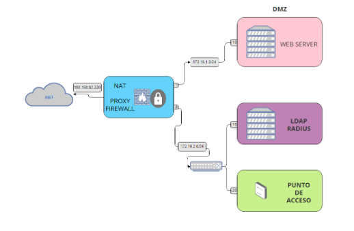

# IMPLEMENTACIÓN DE UNA RED EMPRESARIAL


Gheorghe Covaci Coldar, Santiago E. Carpente Burguete, Javier Contell Adell

Seguridad y Alta Disponibilidad
2º ASIR- 2023/24

---
---
# ÍNDICE
**Introducción**........................................................................................................................... 3

**Retos y Objetivos**.....................................................................................................................3

Implementación de la Arquitectura de Red Empresarial......................................................... 3

Servidores y Herramientas Utilizadas................................................................................. 3

Estructura de Red Propuesta.............................................................................................. 4

**INSTALACIÓN SERVIDOR FIREWALL/PROXY**.................................................................... 5

1. Instalación del Sistema Operativo..................................................................................5

2. Configuración de Interfaces de Red...............................................................................5

3. Preparación del Firewall.................................................................................................5

4. Creación de Reglas........................................................................................................6

5. Instalación de SQUID Proxy...........................................................................................7

Configuración punto de acceso........................................................................................... 8

**INSTALACIÓN Y CONFIGURACIÓN SERVIDOR LDAP**..................................................... 10

1. Instalación de los paquetes..........................................................................................10

2. Creación de la estructura del directorio de LDAP........................................................ 10

3. Instalación y configuración de LAM..............................................................................11

**INSTALACIÓN Y CONFIGURACIÓN DEL SERVIDOR WEB**.............................................. 13

1. Instalación de Apache.................................................................................................. 13

2. Generación de la clave SSL.........................................................................................13

3. Configuración del Virtual Host......................................................................................13

---
--- 
# Introducción

En el marco de la práctica final de este curso, nos enfrentamos al desafío de aplicar de
manera integral los conocimientos adquiridos, desarrollando un plan de trabajo eficiente en
equipo. Este proyecto tiene como objetivo principal la implementación de una arquitectura
de red empresarial, donde la gestión de objetivos, resolución de problemas y
documentación técnica juegan un papel crucial.

---
---

# Retos y Objetivos
**Implementación de la Arquitectura de Red Empresarial**

- Diseño de Red: Configuración de 2 redes internas y una zona DMZ para albergar
servidores públicos.

- Firewall: Desarrollo de reglas iptables para controlar el tráfico y garantizar la
seguridad de la red.

- Proxy Transparente: Configuración de un proxy que permita la navegación a Internet
tras validar usuarios en el servidor LDAP.

- Control de Acceso: Restricción de acceso a páginas no deseadas.

- Seguridad Inalámbrica: Implementación de una subred para clientes WIFI
autorizados mediante RADIUS/LDAP.

**Servidores y Herramientas Utilizadas**

- Servidor LDAP: Utilización de un servidor LDAP para la gestión de usuarios en el
proxy y autenticación de clientes inalámbricos.

- LAM (ldap-account-manager): Implementación de un GUI para facilitar la
configuración, gestión y mantenimiento del directorio LDAP.

- Servidor Web: Despliegue de un servidor web en la DMZ para alojar la
documentación del proyecto en formato markdown.

- Servidor Radius: Autenticación de peticiones de clientes inalámbricos provenientes
del punto de acceso.


**Estructura de Red Propuesta**



En resumen, afrontamos el desafío de crear una infraestructura que garantice la seguridad,
la eficiencia operativa y el cumplimiento de requisitos específicos. El trabajo en equipo, la
planificación detallada y la aplicación práctica de los conceptos aprendidos serán
fundamentales para alcanzar el éxito en este proyecto.

---
---
# INSTALACIÓN SERVIDOR FIREWALL/PROXY
**1. Instalación del Sistema Operativo**

Instala una distribución de Linux en el servidor. Puedes optar por una distribución como
Ubuntu Server o CentOS, que son opciones comunes y ampliamente soportadas. En este
caso usaremos ubuntu server.

**2. Configuración de Interfaces de Red**

Configura las interfaces de red para reflejar la topología de tu red empresarial. Abre el
archivo de configuración de red, generalmente ubicado en /etc/netplan o
/etc/network/interfaces, en este caso /etc/netplan.

```bash
network:
    ethernets:
        enp0s3:            
            addresses:
            - 192.168.82.220/24
        nameservers:
            addresses:
            - 192.168.82.100
            - 8.8.8.8
            search: []
        routes:
            - to: default
            via: 192.168.82.100
        enp0s8:
            addresses:
            - 172.16.1.1/24
        enp0s9:
            addresses:
            - 172.16.2.1/24
version: 2
```

**3. Preparación del Firewall**

Con el servidor configurado con las direcciones IP correspondientes, procedemos a la
instalación de netfilter-persistent, la herramienta que utilizaremos para establecer las reglas
de nuestro firewall. Para ello, actualizamos los repositorios y realizamos la instalación con
los siguientes comandos:

```bash

sudo apt update

sudo apt upgrade

sudo apt install netfilter-persistent
```

Posteriormente, creamos el directorio /etc/iptables, que servirá para almacenar las reglas
del firewall. Además, activamos el reenvío de paquetes con los siguientes comandos:

```bash
mkdir /etc/iptables

sudo netfilter-persistent save

sudo sysctl -w net.ipv4.ip_forward=1

sudo sysctl -p

```
Con estas configuraciones, estamos listos para introducir las reglas específicas del firewall
que controlarán el tráfico en nuestra red. Este paso permitirá garantizar la seguridad y
eficiencia de la arquitectura de red empresarial que estamos implementando.

**4. Creación de Reglas**

Ahora procedemos a establecer las reglas del firewall, siguiendo las directrices específicas
del proyecto. Aquí se detallan las reglas según lo solicitado:

**NAT (Network Address Translation):**
```bash
sudo iptables -t nat -A POSTROUTING -o enp0s3 -j MASQUERADE
```
Esta regla permite realizar la traducción de direcciones de red (NAT) para el tráfico saliente.

**Control de Acceso a la Red Interna:**
```bash
sudo iptables -P FORWARD DROP
```
Se establece una política predeterminada de denegar todo el tráfico de forwarding,
permitiendo un control más preciso de las conexiones.

**Acceso a Internet desde Redes Internas:**
```bash
sudo iptables -A FORWARD -i enp0s8 -o enp0s3 -j ACCEPT

sudo iptables -A FORWARD -i enp0s9 -o enp0s3 -j ACCEPT

sudo iptables -A FORWARD -m state --state RELATED,ESTABLISHED -j ACCEPT
```
Estas reglas permiten el acceso a Internet desde las redes internas y solo aceptan paquetes
establecidos o relacionados.

**Restricción de Acceso desde DMZ a Red Interna:**
```bash
sudo iptables -A FORWARD -i enp0s9 -o enp0s8 -j ACCEPT
```
Se permite el tráfico desde la DMZ al servidor web en la red interna, evitando que actúe
como puerta de entrada.
```bash
Acceso Externo solo al Servidor Web:

sudo iptables -A FORWARD -i enp0s3 -o enp0s8 -p tcp -m multiport
--dports 80,443 -j ACCEPT

sudo iptables -t nat -A PREROUTING -i enp0s3 -p tcp -m multiport
--dports 80,443 -j DNAT --to-destination 172.16.1.10
```
Estas reglas permiten el acceso desde el exterior solo al servidor web y realizan la
traducción de dirección de red (DNAT) para redirigir el tráfico al servidor web interno.

**Tráfico Saliente a través del Proxy:**
```bash
sudo iptables -A FORWARD -s 172.16.2.1/24 -o enp0s3 -j ACCEPT
```
Esta regla dirige el tráfico saliente desde la red interna a través del proxy. Tan solo
guardamos las reglas en el archivo /etc/iptables/rules.v4 y comprobamos que las reglas
funcionen como esperamos.
```bash
sudo iptables-save > /etc/iptables/rules.v4
```
Con estas reglas, se ha configurado el firewall según las especificaciones del proyecto.
Asegúrate de realizar pruebas exhaustivas para verificar que el firewall funcione
correctamente y cumpla con los requisitos establecidos.

**5. Instalación de SQUID Proxy**

La instalación y configuración de nuestro proxy SQUID es un proceso breve y sencillo. A
continuación, se detallan los pasos para llevar a cabo esta tarea:

**Instalamos el paquete de SQUID mediante el siguiente comando:**
```bash
sudo apt install squid
```
_Averiguamos el puerto_ que está utilizando SQUID utilizando el siguiente comando y
veremos que utiliza el 3128:
```bash
sudo netstat -apn | grep squid
```

**Configuración del Archivo squid.conf:**

Editamos el archivo de configuración de SQUID para ajustarlo a nuestras necesidades:
```bash
sudo nano /etc/squid/squid.conf
```
A continuación, añadimos o modificamos las siguientes líneas para habilitar la autenticación
LDAP y restringir el acceso a ciertos grupos de páginas:
```bash
auth_param basic program /usr/lib/squid/ basic_ldap_auth -b “ou=unidad,dc=grupo1,dc=com" -f "uid=%s" -h 172.16.2.15
auth_param basic children 5 startup=5 idle=1 auth_param basic credentialsttl 2 hours

acl ldap_users proxy_auth REQUIRED

acl social dstdomain .instagram.com .x.com .facebook.com

acl juegos dstdomain .minijuegos.com .juegos.com


http_access deny social

http_access deny juegos

http_access allow all
```
Estas líneas permitirán la autenticación en la red a través de las credenciales almacenadas
en la unidad organizativa de LDAP y bloquearán el acceso a ciertos grupos de páginas.

**Guardar y Salir:**

Guardamos los cambios realizados en el archivo y salimos del editor de texto. Reiniciamos
el servicio y procedemos a la prueba de todo lo realizado.
Con estos ajustes en el archivo de configuración, nuestro servidor enrutador/firewall/proxy
está preparado para cumplir con los requisitos de la práctica. Solo restaría configurar los
clientes para que utilicen nuestro servidor como proxy, canalizando todas sus solicitudes a
través del mismo.

---
---
# Configuración punto de acceso
**Configuración del Punto de Acceso con Autenticación Radius**

Para configurar el punto de acceso con autenticación RADIUS, sigue estos pasos
detallados:

- **Restablecimiento del Punto de Acceso:**

    -  Presiona el botón de RESET en la parte trasera del punto de acceso durante 10 segundos para restablecerlo a la configuración de fábrica.

- **Configuración del Cliente:**
    - Asigna al cliente la configuración de red y conectalo al punto de acceso directamente: IP 192.168.1.150/24, Puerta de enlace 192.168.1.245.
- **Acceso a la Interfaz de Configuración:**
    - Abre el navegador y accede a la dirección 192.168.1.245. Utiliza las credenciales predeterminadas (usuario vacío, contraseña: admin) para acceder a la interfaz de configuración del punto de acceso.

- **Edición de Configuración:**

    -  Una vez en la interfaz de configuración, cambia el nombre del punto de acceso por "grupo1". Este será el nombre visible en tus dispositivos.

- **Configuración de Dirección IP:**

    - Configura la dirección IP estática del punto de acceso: 172.16.2.20, máscara de subred 255.255.255.0, puerta de enlace 172.16.2.1.
- **Configuración de Seguridad:**
    - Selecciona el modo de seguridad "Radius" para habilitar la autenticación a
    través de RADIUS.

- **Añadir Configuración RADIUS:**
    - Añade la dirección IP del servidor RADIUS: 172.16.2.15, puerto de RADIUS:
1812.
- **Guardar Configuración:**

    - Guarda la configuración y espera al reinicio del punto de acceso.

- **Añadir Punto de Acceso a la Red:**

    - Después de guardar la configuración, procede a añadir el punto de acceso a la red correspondiente.

- **Verificación desde la Red:**

    - Una vez añadido a la red, verifica la conectividad desde otros dispositivos. Asegúrate de que los dispositivos puedan descubrir y conectarse al grupo1 con la nueva configuración. 

Con estos pasos, hemos configurado con éxito el punto de acceso para autenticación a
través de RADIUS utilizando el servidor LDAP. Asegúrate de realizar pruebas adicionales
para verificar que la autenticación funcione correctamente y que los dispositivos se
conecten al grupo1 sin problemas.

---
---

# INSTALACIÓN Y CONFIGURACIÓN SERVIDOR LDAP

**1. Instalación de los paquetes**

Para iniciar la configuración del servidor LDAP, instalaremos los paquetes necesarios con el
siguiente comando:
```bash
sudo apt install slapd ldap-utils -y
```
Luego, ejecutaremos el asistente de configuración con el siguiente comando:
```bash
sudo dpkg-reconfigure slapd
```
Durante el asistente, proporcionaremos la siguiente información:

● DNS Domain Name: grupo1.com

● Organization Name: grupo1

● Ingresaremos la contraseña

● Y ante la pregunta "Move old database?", seleccionaremos Sí.

Para verificar la configuración, podemos ejecutar el siguiente comando:
```bash
sudo slapcat
```

**2. Creación de la estructura del directorio de LDAP**

Iniciaremos la estructura del directorio creando el archivo ou.ldif con el siguiente contenido:
```bash
dn:ou=unidad,dc=grupo1,dc=com
objectClass: top
objectClass: organizationalUnit
ou: unidad
```
Agregaremos esta información a la base de datos LDAP con el siguiente comando:
```bash
sudo ldapadd -x -D cn=admin,dc=grupo1,dc=local -W -f ou.ldif
```
A continuación, crearemos el grupo con el archivo grp.ldif que contiene:
```bash
dn:cn=grupo,ou=unidad,dc=grupo1,dc=com
objectClass: top
objectClass: posixGroup
gidNumber: 10000
cn: grupo
```
Lo añadiremos con el siguiente comando:
```bash
sudo ldapadd -x -D cn=admin,dc=grupo1,dc=local -W -f grp.ldif
```
Finalmente, crearemos el archivo usr.ldif para el usuario con el siguiente contenido:
```bash
dn:uid=sanjav,ou=unidad,dc=grupo1,dc=com
objectClass: top
objectClass: posixAccount
objectClass: inetOrgPerson
objectClass: person
cn: sanjav
uid: sanjav
uidNumber: 2000
gidNumber: 10000
homeDirectory: /home/sanjav
loginShell: /bin/bash
userPassword: sanjav
sn: asir
```
```bash
sudo ldapadd -x -D cn=admin,dc=grupo1,dc=local -W -f usr.ldif
```
**3. Instalación y configuración de LAM**

Se instalan los paquetes necesarios para configurar el entorno del programa, incluyendo
Apache2, PHP, y otros módulos requeridos.
```bash
sudo apt install apache2 php php-cgi libapache2-mod-php php-mbstring
php-common php-pear -y
```
Se activa la configuración de php-cgi para asegurar que PHP se integre correctamente con
Apache.
```bash
sudo a2enconf php(versión que hemos instalado)-cgi
```
Se aplica la configuración actualizada del servidor Apache.
```bash
sudo systemctl reload apache2
```
Se instala el administrador de cuentas LDAP, proporcionando una interfaz gráfica para
gestionar el directorio LDAP.
```bash
sudo apt install ldap-account-manager –y
```
Para limitar el acceso a la interfaz web de LDAP Account Manager (LAM) a equipos de la
red local, realizaremos los siguientes pasos:

-  Editaremos el archivo de configuración de LAM:
```bash
sudo nano /etc/apache2/conf-enabled/ldap-account-manager.conf
```
- Comentaremos la línea "Require all granted" y agregaremos la siguiente línea
debajo:
Require ip 127.0.0.1 172.16.2.15/24

- Guardaremos los cambios y reiniciaremos Apache:
```bash
sudo systemctl restart apache2
```

**Configuración Inicial de LAM:**

Accederemos a la interfaz web de LAM en el navegador: http://172.16.2.15/lam

Iremos a “LAM configuration”, y le daremos a “general settings”.

Nos pedirá una contraseña, esta contraseña es ‘lam’, y es la predeterminada de LAM. Y cambiaremos la contraseña maestra por la que nosotros queramos, le daremos a OK
después.

Iremos de nuevo a “LAM configuration” y seleccionaremos "edit server profiles". La
contraseña es ‘lam’. En la pestaña general settings (ajustes generales), cambiaremos en “security settings”
nuestra información, la cual es:
cn=admin,dc=grupo1,dc=com

Y cambiaremos más abajo la contraseña en “profile password”, poniendo la que queramos.
Y ahora en la pestaña llamada “account types” (tipos de cuenta), cambiaremos el LDAP
suffix tanto de “users” como de “groups”.
ou=unidad,dc=grupo1,dc=com

Y le daremos a guardar.

Ahora entraremos en LAM en http://localhost/lam/templates/login.php y tendremos ahí
nuestros grupos y usuarios que hemos creado.

Finalmente, crearemos en LAM el grupo 'invitado' y el usuario 'invitado', ambos con la
misma contraseña. El usuario estará dentro del grupo con el mismo nombre.

---
---
# INSTALACIÓN Y CONFIGURACIÓN DEL SERVIDOR WEB

**1. Instalación de Apache**

Para comenzar, instalaremos Apache en el servidor web con el siguiente comando:
```bash
sudo apt install apache2
```
Una vez instalado, podemos verificar su funcionamiento abriendo el navegador y visitando
nuestra dirección IP para visualizar el archivo predeterminado index.html de Apache.

**2. Generación de la clave SSL**

Ahora, crearemos una clave SSL para habilitar el protocolo HTTPS. Ejecutaremos el
siguiente comando para generar la clave y el certificado autofirmado:
```bash
sudo openssl req -x509 -nodes -days 365 -newkey rsa:2048 -keyout /etc/ssl/private/apache-selfsigned.key -out /etc/ssl/certs/apache-selfsigned.crt
```
Durante este proceso, se nos solicitará información que completaremos.

Habilitaremos el módulo SSL.
```bash
sudo a2enmod ssl
```

**3. Configuración del Virtual Host**

Vamos a crear un dominio en el directorio /var/www/ y no el predeterminado que es
/var/www/html .

Creamos el directorio para el dominio:
```bash
sudo mkdir /var/www/grupo1
```
Ahora asignamos la propiedad del directorio con $USER.
```bash
sudo chown -R $USER:$USER /var/www/grupo1
```
Dentro de este directorio, crearemos un archivo HTML personalizado:
```bash
sudo nano /var/www/grupo1/index.html
```
Y añadiremos contenido, por ejemplo:
```bash
<h1>Grupo1</h1>
```
A continuación, configuraremos un archivo de host virtual para Apache:
```bash
sudo nano /etc/apache2/sites-available/grupo1.conf
```
Con el siguiente contenido:
```bash
<VirtualHost *:443>
ServerName 172.16.2.10
DocumentRoot /var/www/grupo1
SSLEngine on
SSLCertificateFile /etc/ssl/certs/apache-selfsigned.crt
SSLCertificateKeyFile /etc/ssl/private/apache-selfsigned.key
</VirtualHost>
<VirtualHost *:80>
ServerName 172.16.2.10
Redirect / https://172.16.2.10/
</VirtualHost>
```
Podemos verificar la configuración con:
```bash
sudo apache2ctl configtest
```
Luego, habilitaremos el nuevo host virtual y deshabilitaremos el predeterminado:
```bash
sudo a2dissite 000-default.conf
sudo a2ensite grupo1.conf
```
Finalmente, reiniciamos Apache para aplicar los cambios:
```bash
sudo systemctl restart apache2
```
Ahora, el servidor web está configurado para utilizar SSL y mostrar el contenido
personalizado en el directorio del grupo1.
